# Docker Swarm

## Overview Docker machine

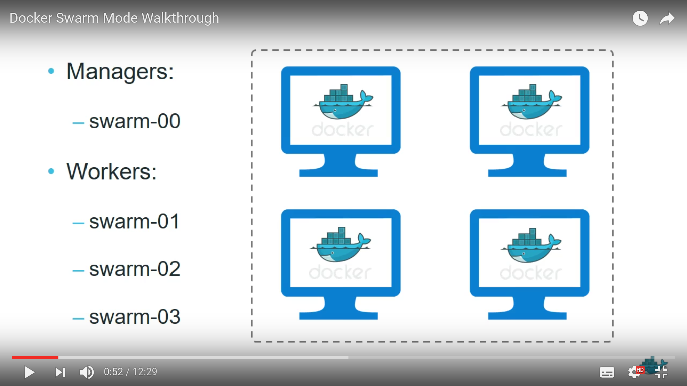 Gambar 1.1

Gambar di atas menjelaskan sekilas tentang arsitektur dalam docker swarm, di mana terdapat 1 manager dan 3 workers

### kenapa docker machine

  Docker-machine adalah sebuah tool yang kita install pada docker -engine.
  Docker-machine berjalan di atas virtual host. Fungsinya adalah untuk memanage hosts di komputer local kita. Dengan docker-machine kita bisa membuat host  di komputer local, atau virtual box, dapat gunakan untuk data-center, AWS, dan Digital Ocean, dll.

## How to install docker machine
* curl -L https://github.com/docker/machine/releases/download/v0.8.2/docker-machine-`uname -s`-`uname -m` >/usr/local/bin/docker-machine
* chmod +x /usr/local/bin/docker-machine
* docker-machine -v
  jika sudah berhasil kita bisa mengeceknya menggunakan perintah di atas untuk cek versi docker-machine
  
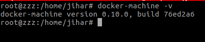 Gambar 1.2

## How to create node on docker-machine
  Untuk membuat node pada docker-machine, di sistem anda harus terinstall virtual machine seperti (virtual box, qemu, vmware, dll), untuk tutorial ini saya menggunakan virtual box.
  barikut cara membuat workers atau node dalam virtual machine:
    * docker-machine create --driver virtualbox node1
    * docker-machine create --driver virtualbox node2
    * docker-machine create --driver virtualbox node3
  Jika di setiap node anda ingin mengatur resourcenya, seperti hdd, ram, processor dll. bisa menggunakan perintah di bawah ini
    * docker-machine create --driver virtualbox --virtualbox-memory "512" --virtualbox-disk-size "5000" node4
  selanjutnya cek docker-machine anda dengan menggunakan perintah docker-machine ls
  
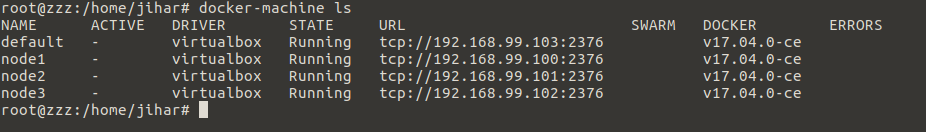 Gambar 1.3

## How to join
  Join di gunakan untuk menggabungkan beberapa node dan menjadikan salah satu sebagi leader.

### konfigurasi pada manager

  * docker swarm init –advertise-addr (ip address manager)
    ip ini saya ambil dari ip virtual-box saya.

    
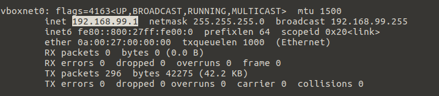 Gambar 1.4

**inisialisasi**

  
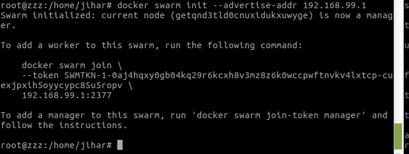 Gambar 1.5

  `docker swarm init --advertise-addr 192.168.99.1`

**mengecek token**

  
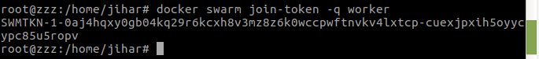 Gambar 1.6

  `docker swarm join-token -q worker`

### konfigurasi pada node untuk melakukan join.

  **Mengakses ke masing masing node**
   `docker-machine ssh nama node`
    
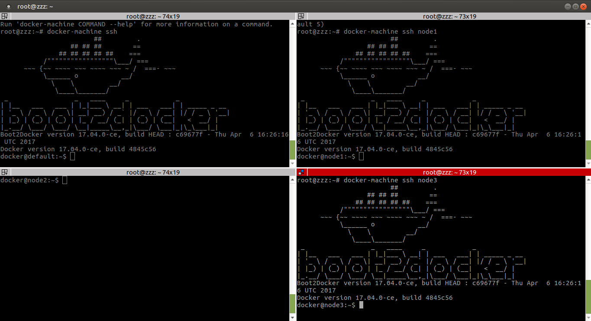 Gambar 1.7

  * docker swarm join (ip address manager):2377 --token(token pada manager)
    `docker swarm join 192.168.99.1:2377 --token SWMTKN-1-0aj4hqxy0gb04kq29r6kcxh8v3mz8z6k0wccpwftnvkv4lxtcp-cuexjpxih5oyycypc85u5ropv`

    
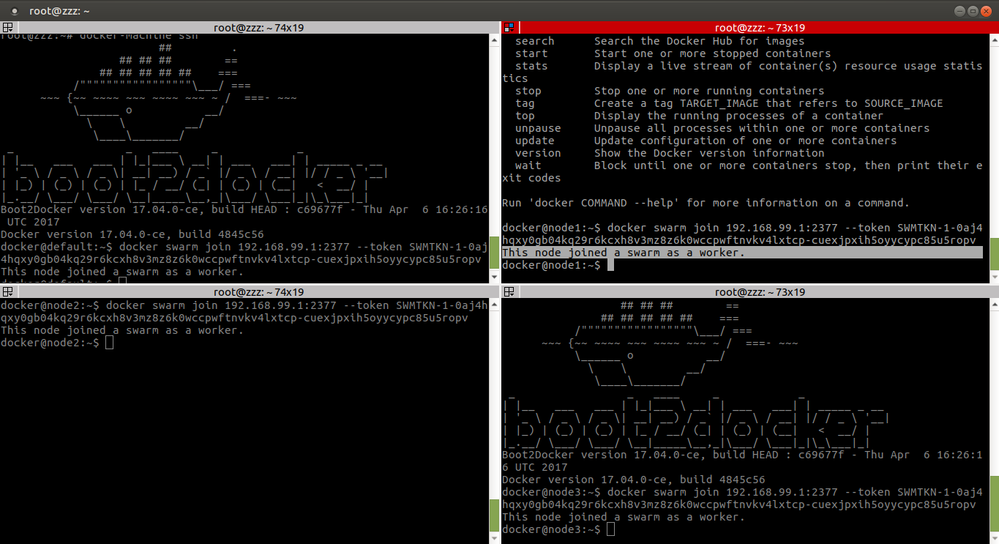 Gambar 1.8

    selanjutnya cek status node pada para terminaluntuk mengetahui leader dan workers, gunakan perintah
    `docker node ls`
    
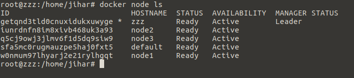 Gambar 1.9

## Deploy service to Docker-Swarm

  Untuk menjalankan service hal pertama yang harus anda punya adalah image App yang akan di jalankan, pada panduan ini saya menggunakan images saya sendiri yaitu `jiharalgifari/web-nginx:v1` yang saya akan jadikan sebuah service. berikut implementasinya

  `docker service create --name web-saya -p 80:80 --replicas 2 jiharalgifari/web-nginx:v1`

  perintah di atas bermaksud untuk menjalankan service dengan nama `web-saya` yang akan di publish ke port 80 dengan replicas 2.

  untuk mengecek service yang berjalan bisa menggunakan perintah `docker service ls`
  
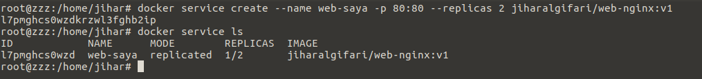 Gambar 1.10

  selanjutnya kita bisa mengecek service yang berjalan di setiap node1

  1. Pada komputer lokal localhost (localhost:80)
    
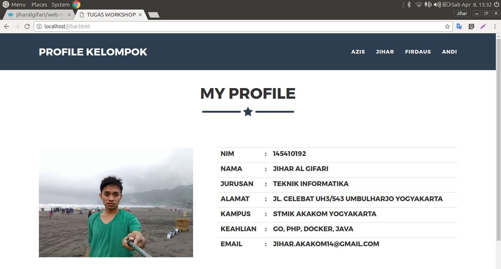 Gambar 1.11

  2. pada node1 (http://192.168.99.100/)
    
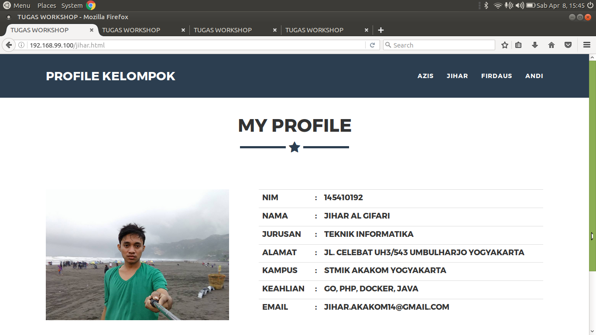 Gambar 1.12

  3. pada node2 (http://192.168.99.101/)
    
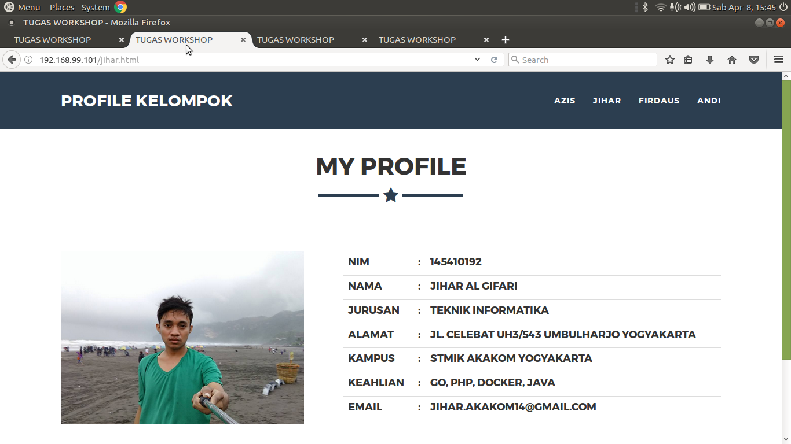 Gambar 1.13

  4. pada node3 (http://192.168.99.102/)
    
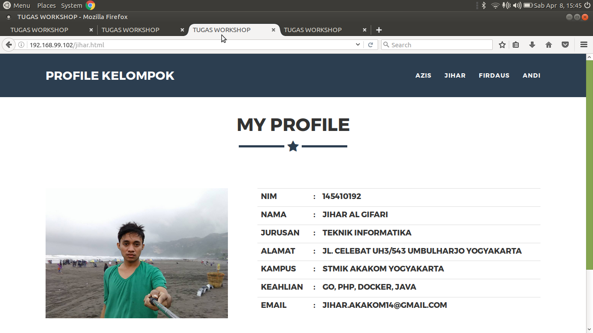 Gambar 1.14

## How to scale

untuk melakukan scale service anda bisa menggunakan perintah
`docker service scale web-saya=8`
dan untuk mengecek hasil scale bisa menggunakan perintah `docker service ps web-saya`

di sini kita bisa melihat node apa saja yang menangani service, nama image yang jalan, dan waktu ketika service start.

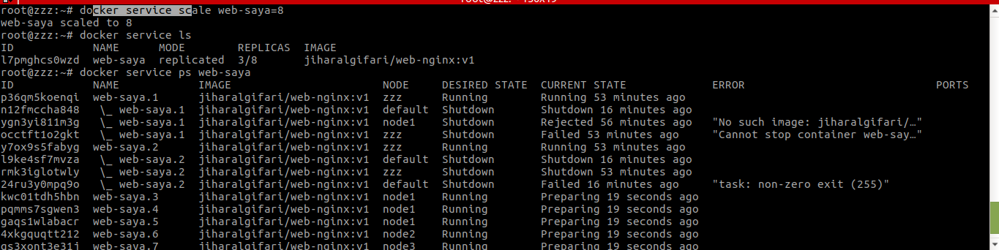 Gambar 1.15

## Configuring resource

konfigurasi resource bermaksud untuk mengkonfigurasi kebutuhan Ram, Processor  dengan dengan batas tertentu yang di pakai saat service sedang jalan.

untuk menlakukan konfigurasi bisa menggunakan perintah
`docker service update --limit-cpu 1 --limit-memory 512mb web-saya`

maksud dari perintah di atas adalah untuk mengatur service web-saya dengan limit CPU 1 dan limit memory 512MB.

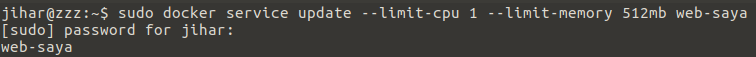 Gambar 1.16

Untuk mengeceknya bisa menggunakan perintah `docker service inspect --pretty web-saya`

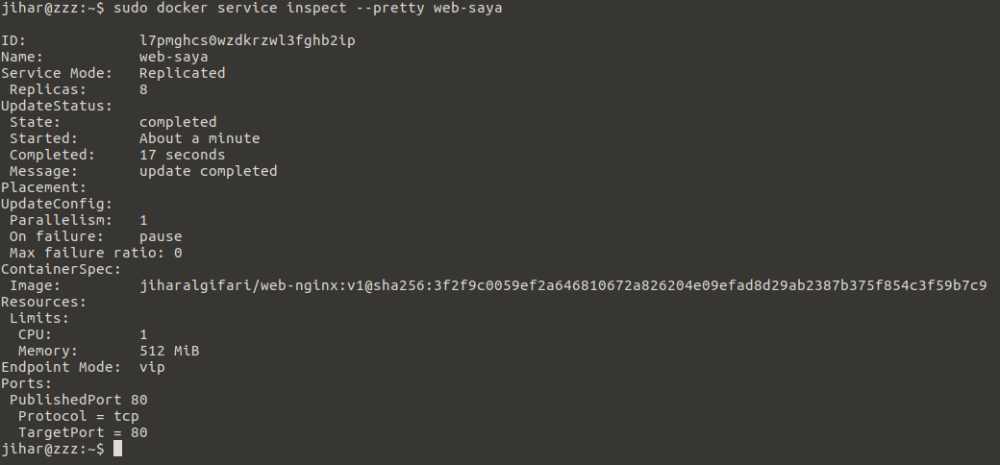 Gambar 1.17

