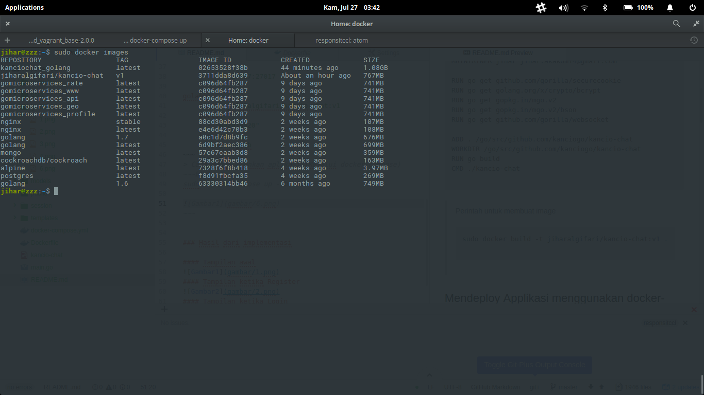
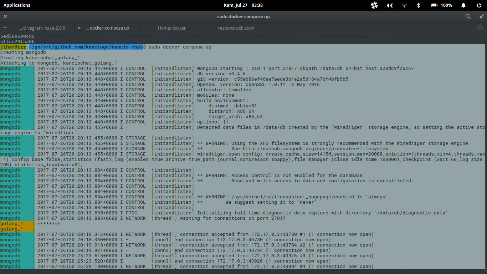
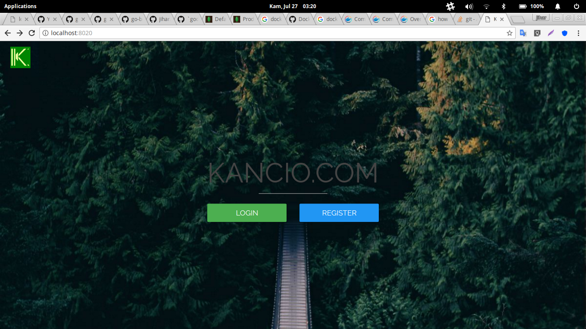
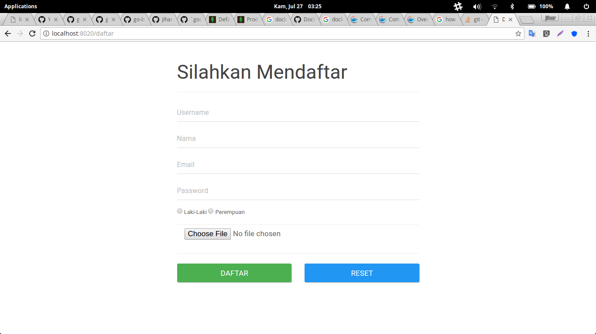
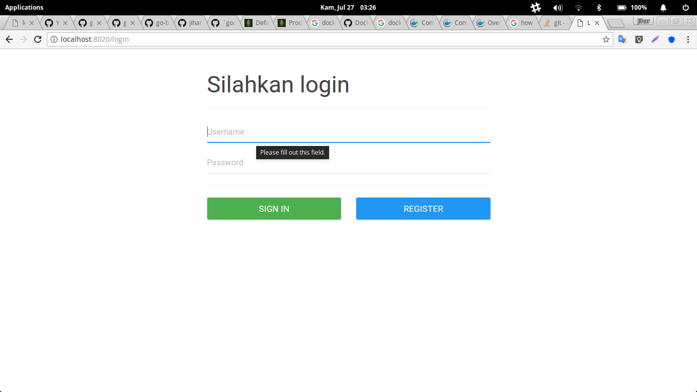
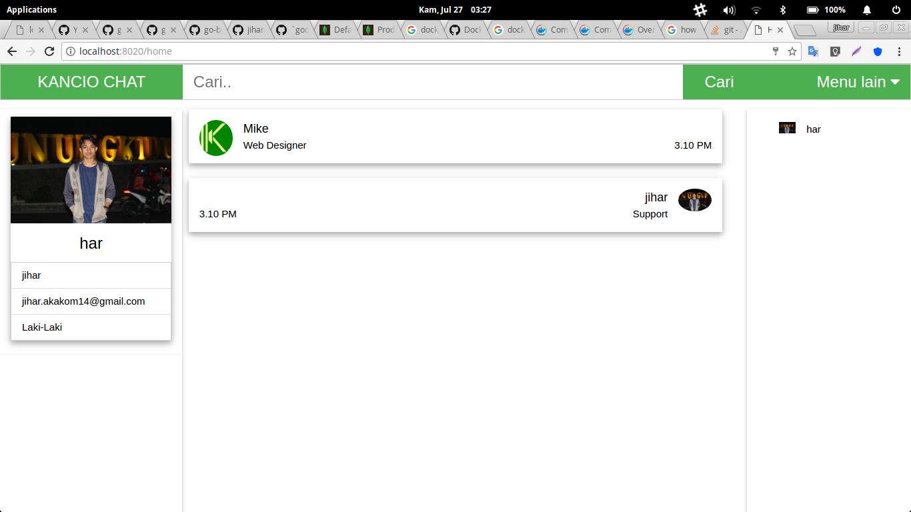

# Responsi Teknologi Cloud Computing Lanjut (TCCL)
Impletasi sistem daftar dan login menggunakan Golang dan database MongoDB

### Membuat image dari aplikasi yang di bangun menggunakan file Dockerfile.
~~~Dockerfile
FROM golang
MAINTAINER jihar jihar.akakom14@gmail.com

RUN go get github.com/gorilla/securecookie
RUN go get golang.org/x/crypto/bcrypt
RUN go get gopkg.in/mgo.v2
RUN go get gopkg.in/mgo.v2/bson
RUN go get github.com/gorilla/websocket

ADD . /go/src/github.com/kanciogo/kancio-chat
WORKDIR /go/src/github.com/kanciogo/kancio-chat
RUN go build
CMD ./kancio-chat
~~~

> Perintah untuk membuat image
~~~bash
sudo docker build -t jiharalgifari/kancio-chat:v1 .
~~~
Image hasil build

### Mendeploy Applikasi menggunakan docker-compose.
~~~yaml
mongodb:
    image: mongo
    container_name: "mongodb"
    environment:
          - MONGO_DATA_DIR=/data/db
          - MONGO_LOG_DIR=/dev/null
    volumes:
          - ./data/db:/data/db
    ports:
          - 27017:27017

golang:
    image: jiharalgifari/kancio-chat:v1
    ports:
      - "8020:8020"
    links:
        - mongodb
~~~
> Cara menjalalankan aplikasi (Melalui docker-compose)
~~~bash
sudo docker-compose up --build
~~~

### Hasil dari implementasi

#### Tampilan awal

#### Tampilan ketika Register

#### Tampilan ketika Login

#### Tampilan ketika berhasil login

